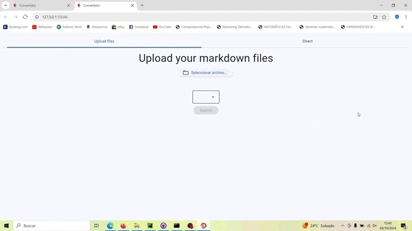

  <h1>Markdown to HTML & PDF Converter</h1>
  

## Summary

This project is a web-based application built with Flet that allows you to convert Markdown files to HTML and PDF. The first window lets you transform files, and the second window converts them while allowing you to make modifications.

## Features

- **File Transformation**: The first window provides an interface to upload and transform Markdown files into HTML and PDF formats.
- **Live Conversion**: The second window displays the converted content and allows you to make real-time modifications.
- **User-Friendly Interface**: Easy-to-use interface with clear instructions for converting and modifying files.

## How to Use

1. **Launch the Application**: Open the application in your web browser.
2. **Upload Files**: Use the first window to upload your Markdown files.
3. **Convert Files**: Transform your Markdown files into HTML and PDF formats.
4. **Modify and View**: Use the second window to view the converted content and make any necessary modifications.

Enjoy converting your Markdown files with ease!
